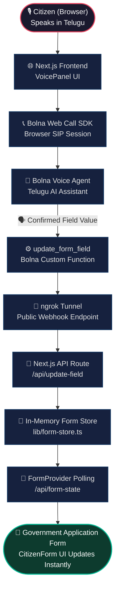

# 🏛️ Bolna India – Voice-First Government Form Filling (Telugu)

Bolna India is a voice-first prototype that demonstrates how Indian government forms can be completed entirely through a natural Telugu conversation.

Instead of typing into a form, a citizen simply speaks in Telugu. The AI assistant collects, confirms, and submits the information in real time, while the application updates automatically on screen. The experience is inspired by an Aadhaar-style address update workflow and showcases how **speech can become the primary interface for public service delivery**.

---

## 🇮🇳 The Problem

Millions of citizens struggle with digital government forms because of:

* Language barriers
* Low digital literacy
* Complex government portals
* Mobile typing difficulties
* Accessibility challenges for elderly and rural users

Even a simple address update often requires navigating multiple screens and manually entering several fields.

---

## 💡 The Solution

Bolna India replaces manual form filling with a natural Telugu conversation.

The assistant collects four common address-update fields:

* Full Name
* Mobile Number
* District
* New Residential Address

Each value is repeated for confirmation, and once confirmed, it is **instantly written into the government application form**. The result is a **live, voice-driven government workflow**.

---

## ✨ What the Prototype Demonstrates

* 🎙️ Telugu voice conversation
* 🤖 AI-powered field extraction
* ✅ Field-by-field confirmation
* 🔄 Real-time form updates
* 📋 Government-style address update application
* ☎️ Browser-based voice calling
* 🌐 Live webhook integration using ngrok
* ⚡ End-to-end speech-to-form automation

---

## 🏗️ System Architecture



---

## 🔄 End-to-End Flow

1. User clicks **Start Voice Session**
2. Browser connects to a **Bolna voice agent**
3. Agent speaks in Telugu and asks for one field at a time
4. User responds naturally
5. Agent repeats the value for confirmation
6. Bolna invokes **update_form_field**
7. A webhook calls **/api/update-field**
8. Next.js updates the application state
9. The government form is updated instantly on screen
10. The process repeats until all four fields are completed

---

## 🧠 Tech Stack

### Frontend

* Next.js 16
* React 19
* TypeScript
* Tailwind CSS
* shadcn/ui

### Voice & AI

* Bolna Web Call SDK
* SIP over WebSocket
* Telugu conversational agent
* Function calling
* Real-time webhooks

### Backend

* Next.js API Routes
* In-memory form store
* REST webhook endpoints

### Networking

* ngrok (public webhook exposure)

---

## ⚙️ Bolna Integration

The Bolna agent is configured with a custom function:

```json
{
  "name": "update_form_field",
  "field": "full_name | phone_number | district | new_address",
  "value": "confirmed value"
}
```

After each confirmation, Bolna sends a **POST** request to:

```text
/api/update-field
```

which immediately updates the application state and synchronizes the UI.

---

## 🧪 Tested End-to-End

The prototype has been successfully tested with a complete Telugu conversation.

```text
Full Name:        రవి కుమార్
Mobile Number:    6303366896
District:         ఈస్ట్ గోదావరి
New Address:      12-3-45, గాంధీ స్ట్రీట్, అమలాపురం
```

All four values were extracted, confirmed, transmitted through Bolna webhooks, and populated into the government application form in real time.

---

## 🎯 Why This Matters

This is not just a speech-to-text demo.

It demonstrates a complete **voice-native government workflow**:

**Conversation → Confirmation → Function Call → Webhook → Form Update**

The same architecture can power:

* Aadhaar address updates
* Ration card applications
* Pension forms
* PM-Kisan registration
* Voter ID corrections
* Municipal service requests
* Rural citizen service centers

---

## 🚀 Future Improvements

* PDF generation
* Official Aadhaar-style UI
* PIN code validation
* Address normalization
* Multilingual support (Hindi, Tamil, Kannada, Bengali)
* Document upload assistance
* OTP verification
* Integration with government APIs
* WhatsApp voice interface
* Persistent user sessions

---

## ❤️ Built for Accessible Public Services

Bolna India explores a simple idea:

> **Government forms should be filled through conversation, not complexity.**

One Telugu conversation. Four confirmed fields. A completed government application.

This prototype demonstrates how voice interfaces can make digital public services significantly more accessible for millions of Indian citizens.